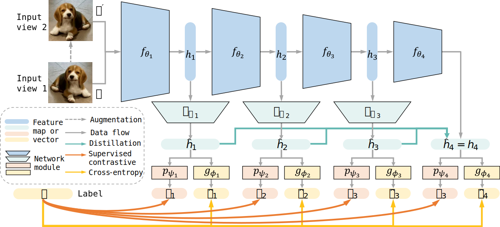

# MOSE
Official implementation of [MOSE](links.here) for online continual learning (CVPR2024).

## Introduction



Multi-level Online Sequential Experts (MOSE) cultivates the model as stacked sub-experts, integrating multi-level supervision and reverse self-distillation. Supervision signals across multiple stages facilitate appropriate convergence of the new task while gathering various strengths from experts by knowledge distillation mitigates the performance decline of old tasks.

## Usage
### Requirements
* python==3.8
* pytorch==1.12.1
```
pip install torch==1.10.1+cu111 torchvision==0.11.2+cu111 torchaudio==0.10.1 -f https://download.pytorch.org/whl/cu111/torch_stable.html
pip install -r requirements.txt
```

### Training and Testing
**Split CIFAR-100**

```bash
python main.py \
--dataset           cifar100 \
--buffer_size       5000 \
--method            mose \
--seed              0 \
--run_nums          5 \
--gpu_id            0
```

**Split TinyImageNet**

```bash
python main.py \
--dataset           tiny_imagenet \
--buffer_size       10000 \
--method            mose \
--seed              0 \
--run_nums          5 \
--gpu_id            0
```

## Acknowledgement

Thanks the following code bases for their framework and ideas:
- [OnPro](https://github.com/weilllllls/OnPro)
- [GSA](https://github.com/gydpku/GSA)
- [OCM](https://github.com/gydpku/OCM)

## Citation
If you found this code or our work useful, please cite us:

```bibtex
@misc{yan2024orchestrate,
    title={Orchestrate Latent Expertise: Advancing Online Continual Learning with Multi-Level Supervision and Reverse Self-Distillation}, 
    author={HongWei Yan and Liyuan Wang and Kaisheng Ma and Yi Zhong},
    year={2024},
    eprint={2404.00417},
    archivePrefix={arXiv},
    primaryClass={cs.LG}
}
```